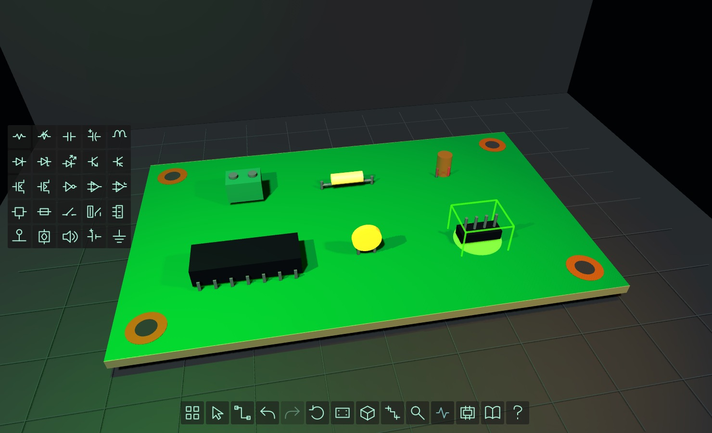

# FormFactor 0.135: smooth construction

The live scene uses `interactive_lab_1135.gd`, building on the dimensioned 0.134 PCB candidate. Startup is a blank 80 × 50 × 1.6 mm 3D board, a symbol-only 25-family catalog and an icon dock. No HUD words, version signs, status banners or drag labels appear during normal construction. Help, component details, schematic, CAD and lessons remain available on demand.

Select a symbol and click repeatedly to build, or drag a catalog tile onto the board. A translucent copy of the actual component previews the final location: cyan means geometric fit; red means blocked. Local recovery searches only three 2.54 mm grid steps in each direction. Fit checks use transformed visual bounds, rotated packages, board edges and mounting-hole keepouts. These are conservative editor constraints, not manufacturer footprints or fabrication DRC.

Use the pointer, Escape or right-click to cancel placement. Drag a placed component to move it; Q/E rotates it. Delete removes the hovered part. Ctrl+Z/Y undo/redo. C opens/closes the catalog without clearing the board. H opens Help. The dock exposes catalog, select, wire, undo, redo, rotate, board reset, camera view, schematic, inspection, connectivity check, CAD, lessons and Help.

## Scientific boundary

The Godot prototype wires whole components; it does not yet provide authoritative pin-level electrical simulation. Finding a power-to-LED graph path now reports connectivity only. It cannot assert an electrical PASS or light the LED as proof. Electrical, thermal, voltage/current, return-path and manufacturing results remain UNKNOWN. The C++ engineering core is unchanged. Mesh fit and cyan previews confer no electrical approval. Historical validators execute explicit version fixtures so an old UI or pedagogical LED behavior cannot constrain the current live UX; the new validator exclusively exercises the actual main scene.

## Validation

- 31 native C++ test executables passed under C++20 strict warnings.
- Six Python CAD bridge tests and version/identity checks passed.
- All 17 Godot validators passed, including the current main-scene test for blank startup, wordless buttons, all 25 catalog entries, fit/keepouts, local recovery, drag preview, stock conservation, repeat placement, undo/redo, safe C shortcut and connectivity-with-UNKNOWN.
- The 0.134 validator was repaired to use explicit dynamic types and inspect all DIP pin meshes, including Godot's auto-renamed duplicate nodes.
- CI repeats current gameplay validation in source and packaged trees and captures a fresh rendered JPEG tied to the workflow commit SHA.

